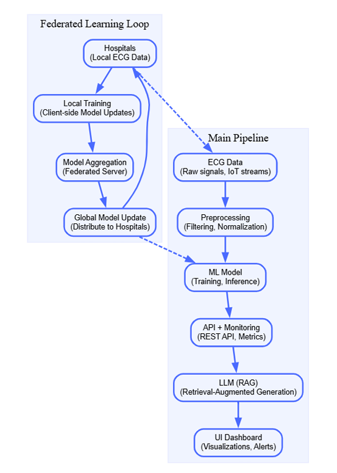

<h1 align="center">HEARTSIGHT</h1>

<p align="center">
  
</p>

<p align="center">
  HEARTSIGHT is an AI-powered ECG monitoring and early warning system designed to support distributed healthcare data collection and predictive diagnostics.
  This README represents <strong>Milestone 1</strong> of the MLOps course project that builds the foundation for a reproducible, production-grade pipeline with CI/CD, monitoring, observability, and compliance features.
</p>

## Table of Contents

1. [Project Overview](#project-overview)
2. [Architecture Diagram](#architecture-diagram)
3. [Quick Start Guide](#quick-start-guide)
4. [Makefile Targets](#makefile-targets)
5. [Deliverables Summary](#deliverables-summary)
6. [Environment Variables](#environment-variables)
7. [FAQ / Troubleshooting](#faq--troubleshooting)
8. [Compatibility](#compatibility)
9. [License & Compliance](#license--compliance)
10. [Notes](#notes)
11. [Bonus Paths](bonus--paths)


## Architecture Diagram

The following diagram illustrates the flow from **data ingestion → training → inference API**, along with supporting MLOps components (CI/CD, monitoring, and compliance).



---

## Quick Start Guide

### 1. Clone the Repository
git clone https://github.com/<your-username>/mlops-phase1.git
cd mlops-phase1
git checkout ms1_hk

### 2. Create and Activate Virtual Environment

To set up your Python virtual environment, execute the following commands in your terminal:
python -m venv venv
.\venv\Scripts\activate

### 3. Install Dependencies

Once your virtual environment is active, install all necessary project dependencies using `pip`:
pip install -r requirements.txt

### 4. Run the Application

To start the application in development mode, use the `make dev` command:

The API will be accessible at: [http://localhost:8000](http://localhost:8000)

### 5. Run Dockerized Version

For a Dockerized deployment, build and run the Docker container with these commands:
make docker
make run

The Docker container will serve the application at: [http://localhost:8000]

### 6. Run with Docker Compose (profiles: dev, test, prod)

This project includes a `docker-compose.yml` with multiple services and profiles:

- `app`: FastAPI service (exposes port 8000)
- `metrics`: Prometheus metrics exporter from `src/monitoring/prometheus_metrics.py` (port 9000)
- `prometheus`: Scrapes the `metrics` service (port 9090)
- `grafana`: Optional dashboards (port 3000)
- `db`: Postgres placeholder (port 5432)

Profiles and commands:

- Dev (app + metrics + prometheus + grafana + db):
  - `docker compose --profile dev up -d`
- Prod (same stack, prod profile):
  - `docker compose --profile prod up -d`
- Test (app + db):
  - `docker compose --profile test up -d`

Ports:

- App: `http://localhost:8000`
- Metrics: `http://localhost:9000`
- Prometheus: `http://localhost:9090`
- Grafana: `http://localhost:3000`

Prometheus is configured via `infra/prometheus/prometheus.yml` to scrape the `metrics` container.

## Makefile Targets

| Target        | Description                                  |
| :------------ | :------------------------------------------- |
| `make dev`    | Run FastAPI app in development mode          |
| `make docker` | Build Docker image                           |
| `make run`    | Run containerized application                |
| `make lint`   | Run Ruff and Black linters                   |
| `make format` | Auto-format code using Black                 |
| `make test`   | Run Pytest with coverage                     |
| `make audit`  | Run dependency and license audit             |
| `make clean`  | pre-commit run --all-files                   |
| `make check`  | Run dependency and license audit             |

## Deliverables Summary

### D1 – Repository and Documentation
- Added `README.md` with architecture, quick start guide, and setup instructions.
- Defined folder structure for scalability and clarity.

### D2 – Collaboration & Contribution
- Added `CONTRIBUTION.md` to define roles and branching conventions.
- Configured `.gitignore` to exclude unwanted files.

### D3 – Dockerization
- Created `Dockerfile` for containerized deployment.
- Added `scripts/healthcheck.sh` for service validation.

### D4 – CI/CD Pipeline
- Implemented GitHub Actions workflow (`.github/workflows/ci.yml`).
- Automated linting, testing, and Docker image builds.

### D5 – Monitoring & Observability
- Integrated **MLflow**, **Evidently**, and **Prometheus**.
- Generated monitoring dashboards and sample reports under `/docs`.

### D6 – Code Quality & Pre-commit Hooks
- Configured `.pre-commit-config.yaml` for linting, formatting, and security scanning.
- Integrated pre-commit validation into GitHub Actions.

### D7 – API Documentation
- Added FastAPI routes (`/`, `/predict`, `/health`).
- Enabled auto-generated Swagger `/docs` and ReDoc `/redoc` UIs.

### D8 – Compliance and Security
- Introduced `.env` for configuration management.
- Implemented `pip-audit` and `pip-licenses` for dependency audits.
- Generated compliance report (`docs/compliance_report.txt`).

### D9 - AWS Cloud Integration

For this milestone, two major AWS services were used — **Amazon EC2** and **Amazon S3**, to deploy and connect a cloud-based FastAPI application for the HEARTSIGHT project. The EC2 instance serves as the **core compute environment** for running the FastAPI inference API.

#### **Instance Details**
- **Instance Name:** `heartsight-api`
- **Operating System:** Ubuntu Server 22.04 LTS (Free Tier eligible)
- **Instance Type:** `t3.micro`
- **Security Group Ports:**
  - SSH (22) → for remote access
  - HTTP (80) → for general web access
  - Custom TCP (8000) → for FastAPI application

#### **Steps to Set Up EC2**

1. **Launch EC2 Instance**
   - Navigate to the AWS Console → **EC2 Dashboard → Launch Instance**
   - Choose AMI: *Ubuntu Server 22.04 LTS (HVM), SSD Volume Type (64-bit x86)*
   - Instance Type: `t3.micro`
   - Create a new key pair → download as `heartsight-key.pem`
   - Under **Network settings**, enable:
     - SSH (22)
     - HTTP (80)
     - Custom TCP (8000)
   - Launch instance and wait until status is **running**.

   <p align="center">
  
  </p>

2. **Set Key File Permissions in PowerShell**
   - Open PowerShell in the folder where the `.pem` file was downloaded:
     ```powershell
     cd C:\Users\HAMMAD\Downloads
     icacls .\heartsight-key.pem /inheritance:r
     icacls .\heartsight-key.pem /grant:r "$env:USERNAME:(R)"
     ```
   - This restricts access to the key file for SSH authentication.

3. **SSH into EC2 Instance**
   - Copy the public IPv4 address from the AWS Console.
   - Run the following in PowerShell:
     ```powershell
     ssh -i .\heartsight-key.pem ubuntu@<EC2_PUBLIC_IP>
     ```
   - On first connection, type `yes` when prompted to continue.

4. **Install Dependencies and Run FastAPI**
   Inside EC2:
   ```bash
   sudo apt update
   sudo apt install -y python3 python3-pip python3-venv git
   git clone https://github.com/MrRaboobi/mlops-phase1.git
   cd mlops-phase1
   git checkout ms1_hk
   python3 -m venv venv
   source venv/bin/activate
   pip install -r requirements.txt
   uvicorn src.api.main:app --host 0.0.0.0 --port 8000

5. Verification
- *Open browser →* visit [http://<PublicIP>:8000/docs]
- The *Swagger UI* confirms the FastAPI app is live and deployed successfully.
<p align="center">
  
</p>
---

#### Amazon S3 (Simple Storage Service)

An *S3 bucket* was used to store and retrieve data objects (for testing file uploads from EC2).

### Bucket Details
- *Bucket Name:* amazon-s3-bucket-1
- *Purpose:* To store application-generated data (e.g., uploaded files from FastAPI).
   <p align="center">
  
  </p>
---

### Steps to Connect EC2 with S3

1. **Create IAM Role**
1. Go to *IAM → Roles → Create role*
2. Select *AWS service → EC2* as the trusted entity.
3. Attach the policy *AmazonS3FullAccess*.
4. Name the role: heartsight-ec2-s3-role

---

2. **Attach IAM Role to EC2 Instance**
1. Go to *EC2 → Instances → Select* heartsight-api
2. Choose *Actions → Security → Modify IAM Role*
3. Select role: heartsight-ec2-s3-role
4. Click *Update IAM Role*
---

3. **Verify Access from EC2**

SSH into the EC2 instance and run:

```bash
aws --version
sudo apt install awscli -y  # if not installed
aws sts get-caller-identity
```

4. **Test S3 Connection**
```bash
aws s3 ls
echo "Test file from EC2" > test.txt
aws s3 cp test.txt s3://amazon-s3-bucket-1/
aws s3 ls s3://amazon-s3-bucket-1/
```
Here is a screenshot showing correct integration of EC2 with S3:
<p align="center">
  
</p>


## Environment Variables

| Variable              | Description                      |
|-----------------------|----------------------------------|
| `MLFLOW_TRACKING_URI` | MLflow tracking server address   |
| `PROMETHEUS_PORT`     | Prometheus metrics port          |
| `SECRET_KEY`          | Mock secret key for API security |
| `APP_ENV`             | Application environment type     |
| `DEBUG`               | Enable or disable debug mode     |

---

## FAQ / Troubleshooting

| Issue                                 | Solution                                                     |
|---------------------------------------|--------------------------------------------------------------|
| **Pre-commit hook fails**             | Run `pip install pre-commit then pre-commit install then pre-commit run --all-files`   |
| **Docker build fails**                | Ensure Docker Desktop and WSL2 backend are running           |
| **Python version mismatch**           | Use Python 3.11 as specified in `requirements.txt`           |
| **Cannot run .sh scripts on Windows** | Use the `.ps1` PowerShell versions provided under `/scripts` |

---

## Compatibility

| Platform           | Status                                      |
|--------------------|---------------------------------------------|
| **Windows 10+**    |  Fully supported (PowerShell-based scripts) |
| **macOS**          |  Tested with Python 3.11                    |
| **Linux (Ubuntu)** | Native bash script support                  |

## License & Compliance

All dependencies were scanned using:

- `pip-audit` → vulnerability detection
- `pip-licenses` → open-source license validation

Audit results stored in `docs/compliance_report.txt`.

Additional resources:

- See `LICENSE` for the project's open-source license (MIT).
- See `CODE_OF_CONDUCT.md` for community standards and reporting guidance.

---


### Notes
- Region: this project commonly uses `us-east-1`. When creating buckets in `us-east-1`, omit the `LocationConstraint` parameter.
- Dependencies: ensure `boto3` is present in `requirements.txt` for containerized runs.


### Bonus Paths

1. Docker Compose with separate dev, test, prod profiles. And also for separate for each service, for example: app, db, and prometheus services.
2.  Dependency vulnerability scan via pip-audit.
---
