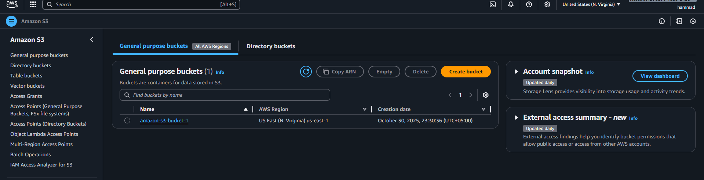
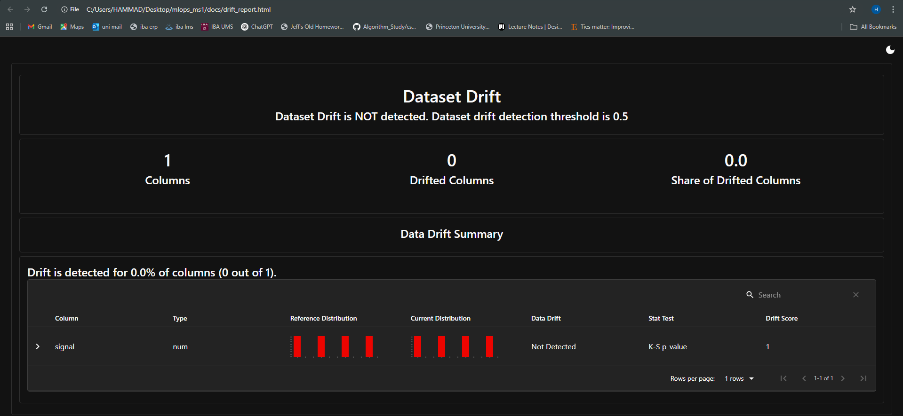

<h1 align="center">HEARTSIGHT</h1>

<p align="center">
  
</p>

<p align="center">
  <strong>AI-Powered ECG Monitoring and Early Warning System</strong>
</p>

<p align="center">
  HEARTSIGHT is an AI-powered ECG monitoring and early warning system designed to support distributed healthcare data collection and predictive diagnostics. This README represents <strong>Milestone 1 & Milestone 2</strong> of the MLOps/LLMOps course project that builds the foundation for a reproducible, production-grade pipeline with CI/CD, monitoring, observability, and compliance features.
</p>

## Table of Contents

1. [Quick Start Guide](#quick-start-guide)
2. [MILESTONE 1](#milestone-1)
3. [MILESTONE 2](#milestone-2)

---

## Quick Start Guide

### Clone the Repository

```bash
git clone https://github.com/MrRaboobi/mlops-phase1.git
cd mlops-phase1
```

### Create and Activate Virtual Environment

To set up your Python virtual environment:

**Windows:**

```bash
python -m venv venv
.\venv\Scripts\activate
```

**Linux/macOS:**

```bash
python -m venv venv
source venv/bin/activate
```

### Install Dependencies

Once your virtual environment is active:

```bash
pip install -r requirements.txt
```

### Run the Application Locally

| Command | Description |
|---------|-------------|
| `python manage.py train` | Run xgboost training pipeline |
| `python manage.py dev` | Start FastAPI dev server (port 8000) |
| `python manage.py test` | Run Pytest test suite |
| `python manage.py lint` | Run Ruff and Black linters |
| `python manage.py format` | Auto-format code using Black |
| `python manage.py clean` | Clean cache files (`__pycache__`, `.pytest_cache`) |
| `python manage.py check` | Run pre-commit hooks on all files |
| `python manage.py ingest` | Ingest PDFs and create vector database for RAG |
| `python manage.py ui` | Start React frontend dev server (port 3000) |
| `python manage.py ui-build` | Build React frontend for production |

To start the full working project locally, execute the following commands in order on separate terminals:

```bash
python manage.py train
python manage.py ingest
mlflow ui
python manage.py dev
python manage.py ui
```

Wait for the mlflow ui to start. Once the mlflow ui starts, the backend will pick the model logged on mlflow to make predictions (check console output) and then open the frontend. Metric logging will start automatically once the backend starts so no need to write an explicit command for that. However, Prometheus and Grafana work only in containers so run the following commands to start their respective containers.

**For Prometheus:**

```bash
docker run -d -p 9090:9090 -v C:\Users\HAMMAD\Desktop\mlops_ms1\infra\prometheus\prometheus.yml:/etc/prometheus/prometheus.yml prom/prometheus
```

**For Grafana:**

```bash
docker run -d --name sharp_booth -p 3001:3000 -v "C:\Users\HAMMAD\Desktop\mlops_ms1\infra\grafana\provisioning\datasources:/etc/grafana/provisioning/datasources:ro" -v "C:\Users\HAMMAD\Desktop\mlops_ms1\infra\grafana\dashboards:/etc/grafana/provisioning/dashboards:ro" -e GF_SECURITY_ADMIN_PASSWORD=admin -e GF_SECURITY_ADMIN_USER=admin grafana/grafana
```

**Access everything on the following ports:**

- **app**: FastAPI service (exposes port 8000)
- **metrics**: Prometheus metrics exporter (port 9000)
- **prometheus**: Scrapes the metrics service (port 9090)
- **grafana**: Optional dashboards (port 3001)
- **frontend**: exposes port 3000
- **mlflow**: For model logs (port 5000)

### Run Dockerized Version using docker-compose.yml

For a Dockerized deployment:

**Enable build cache and build all the services present in docker-compose.yml:**

```bash
$env:BUILDX_NO_DEFAULT_ATTESTATIONS="1"
$env:DOCKER_BUILDKIT=1
docker compose --profile dev build --progress=plain
```

**Start all the containers:**

```bash
docker compose --profile dev up -d
```

**Access everything on the following ports:**

- **app**: FastAPI service (exposes port 8000)
- **metrics**: Prometheus metrics exporter (port 9000)
- **prometheus**: Scrapes the metrics service (port 9090)
- **grafana**: Optional dashboards (port 3001)
- **frontend**: exposes port 3000
- **mlflow**: For model logs (port 5000)

### Run using Makefile

| Target | Description |
|--------|-------------|
| `make dev` | Run FastAPI app in development mode |
| `make docker` | Build Docker image |
| `make run` | Run containerized application |
| `make lint` | Run Ruff and Black linters |
| `make format` | Auto-format code using Black |
| `make test` | Run Pytest with coverage |
| `make audit` | Run dependency and license audit |
| `make clean` | Run pre-commit hooks on all files |
| `make check` | Run dependency and license audit |

---

## MILESTONE 1

### Project Overview

HEARTSIGHT provides an end-to-end machine learning operations pipeline for ECG analysis and predictive diagnostics. The system incorporates modern MLOps practices including containerization, continuous integration, monitoring, and cloud deployment.

### Architecture Diagram

The following diagram illustrates the flow from **data ingestion → training → inference API**, along with supporting MLOps components (CI/CD, monitoring, and compliance).

<p align="center">
  
</p>

### Deliverables Summary

#### D1 – Repository and Documentation

- Added `README.md` with architecture, quick start guide, and setup instructions
- Defined folder structure for scalability and clarity

#### D2 – Collaboration & Contribution

- Added `CONTRIBUTION.md` to define roles and branching conventions
- Configured `.gitignore` to exclude unwanted files

#### D3 – Dockerization

- Created `Dockerfile` for containerized deployment
- Added `scripts/healthcheck.sh` for service validation

#### D4 – CI/CD Pipeline

- Implemented GitHub Actions workflow (`.github/workflows/ci.yml`)
- Automated linting, testing, and Docker image builds

#### D5 – Monitoring & Observability

- Integrated **MLflow**, **Evidently**, and **Prometheus**
- Generated monitoring dashboards and sample reports under `/docs`

#### D6 – Code Quality & Pre-commit Hooks

- Configured `.pre-commit-config.yaml` for linting, formatting, and security scanning
- Integrated pre-commit validation into GitHub Actions

#### D7 – API Documentation

- Added FastAPI routes (`/`, `/predict`, `/health`)
- Enabled auto-generated Swagger `/docs` and ReDoc `/redoc` UIs

#### D8 – Compliance and Security

- Introduced `.env` for configuration management
- Implemented `pip-audit` and `pip-licenses` for dependency audits
- Generated compliance report (`docs/compliance_report.txt`)

#### D9 – AWS Cloud Integration

For this milestone, two major AWS services were used — **Amazon EC2** and **Amazon S3**, to deploy and connect a cloud-based FastAPI application for the HEARTSIGHT project.

#### Amazon EC2 (Elastic Compute Cloud)

The EC2 instance serves as the **core compute environment** for running the FastAPI inference API.

**Instance Details:**
- **Instance Name:** heartsight-api
- **Operating System:** Ubuntu Server 22.04 LTS
- **Instance Type:** t3.micro
- **Security Group Ports:**
  - SSH (22) → for remote access
  - HTTP (80) → for general web access
  - Custom TCP (8000) → for FastAPI application

**Steps to Set Up EC2:**

1. **Launch EC2 Instance**
   - Navigate to AWS Console → EC2 Dashboard → Launch Instance
   - Choose AMI: Ubuntu Server 22.04 LTS (HVM), SSD Volume Type (64-bit x86)
   - Instance Type: `t3.micro`
   - Create a new key pair → download as `heartsight-key.pem`
   - Under Network settings, enable SSH (22), HTTP (80), Custom TCP (8000)
   - Launch instance and wait until status is **running**

   <p align="center">
     
   </p>

2. **Set Key File Permissions in PowerShell**
   ```powershell
   cd C:\Users\HAMMAD\Downloads
   icacls .\heartsight-key.pem /inheritance:r
   icacls .\heartsight-key.pem /grant:r "$env:USERNAME:(R)"
   ```

3. **SSH into EC2 Instance**
   ```bash
   ssh -i .\heartsight-key.pem ubuntu@<EC2_PUBLIC_IP>
   ```

4. **Install Dependencies and Run FastAPI**
   ```bash
   sudo apt update
   sudo apt install -y python3 python3-pip python3-venv git
   git clone https://github.com/MrRaboobi/mlops-phase1.git
   cd mlops-phase1
   git checkout ms1_hk
   python3 -m venv venv
   source venv/bin/activate
   pip install -r requirements.txt
   uvicorn src.api.main:app --host 0.0.0.0 --port 8000
   ```

5. **Verification**
   - Open browser → visit `http://<PublicIP>:8000/docs`
   - The Swagger UI confirms the FastAPI app is live

   <p align="center">
     
   </p>

#### Amazon S3 (Simple Storage Service)

An S3 bucket was used to store and retrieve data objects for testing file uploads from EC2.

**Bucket Details:**
- **Bucket Name:** amazon-s3-bucket-1
- **Purpose:** To store application-generated data (e.g., uploaded files from FastAPI)

<p align="center">
  
</p>

**Steps to Connect EC2 with S3:**

1. **Create IAM Role**
   - Go to IAM → Roles → Create role
   - Select AWS service → EC2 as the trusted entity
   - Attach the policy `AmazonS3FullAccess`
   - Name the role: `heartsight-ec2-s3-role`

2. **Attach IAM Role to EC2 Instance**
   - Go to EC2 → Instances → Select heartsight-api
   - Choose Actions → Security → Modify IAM Role
   - Select role: `heartsight-ec2-s3-role`
   - Click Update IAM Role

3. **Verify Access from EC2**
   ```bash
   aws --version
   sudo apt install awscli -y
   aws sts get-caller-identity
   ```

4. **Test S3 Connection**
   ```bash
   aws s3 ls
   echo "Test file from EC2" > test.txt
   aws s3 cp test.txt s3://amazon-s3-bucket-1/
   aws s3 ls s3://amazon-s3-bucket-1/
   ```

   <p align="center">
     
     <br/>
     <em>Screenshot showing correct integration of EC2 with S3</em>
   </p>

### Environment Variables

| Variable | Description |
|----------|-------------|
| `MLFLOW_TRACKING_URI` | MLflow tracking server address |
| `PROMETHEUS_PORT` | Prometheus metrics port |
| `SECRET_KEY` | Mock secret key for API security |
| `APP_ENV` | Application environment type |
| `DEBUG` | Enable or disable debug mode |

### FAQ / Troubleshooting

| Issue | Solution |
|-------|----------|
| Pre-commit hook fails | Run `pip install pre-commit` then `pre-commit install` then `pre-commit run --all-files` |
| Docker build fails | Ensure Docker Desktop and WSL2 backend are running |
| Python version mismatch | Use Python 3.11 as specified in `requirements.txt` |
| Cannot run .sh scripts on Windows | Use the `.ps1` PowerShell versions provided under `/scripts` |

### Compatibility

| Platform | Status |
|----------|--------|
| Windows 10+ | Fully supported (PowerShell-based scripts) |
| macOS | Tested with Python 3.11 |
| Linux (Ubuntu) | Native bash script support |

### License & Compliance

All dependencies were scanned using:

- `pip-audit` → vulnerability detection
- `pip-licenses` → open-source license validation

Audit results stored in `docs/compliance_report.txt`.

**Additional resources:**

- See `LICENSE` for the project's open-source license (MIT)
- See `CODE_OF_CONDUCT.md` for community standards and reporting guidance

### Notes

- **Region:** This project commonly uses `us-east-1`. When creating buckets in `us-east-1`, omit the `LocationConstraint` parameter.
- **Dependencies:** Ensure `boto3` is present in `requirements.txt` for containerized runs.

### Bonus Paths Explored

1. Docker Compose with separate dev, test, prod profiles. And also for separate for each service, for example: app, db, and prometheus services (everything mentioned in detail in the quick start guide).
2. Dependency vulnerability scan via `pip-audit`.

---

## MILESTONE 2

### Phase 1 - Traditional ML model

The training pipeline (`src/pipeline/train.py`) processes the PTB-XL Reformatted Dataset (`train_signal.csv` and `train_meta.csv` in `data/raw/`) to build an XGBoost classifier for 12-lead ECG signal classification. The model accepts ECG signals with shape (time_steps, 12) where time_steps can vary (typically ~1000 samples), representing 12 standard ECG leads (I, II, III, aVR, aVL, aVF, V1–V6).

**Feature Extraction:**

The training script extracts 108 statistical features (9 per channel) from each 12-lead signal: mean, std, min, max, percentiles (25th, 50th, 75th), range, and variance. This converts variable-length time-series signals into fixed-size feature vectors suitable for tree-based models.

**Target Classes:**

The model predicts one of five diagnostic super-classes: NORM (Normal), MI (Myocardial Infarction), STTC (ST-T Changes), CD (Conduction Disturbance), and HYP (Hypertrophy). Labels are extracted from one-hot encoded columns in `train_meta.csv` and converted to class indices using LabelEncoder.

**MLflow Integration:**

Training parameters (n_estimators, max_depth, learning_rate, model_type, data_source) are logged as MLflow parameters. Metrics including test accuracy and macro-averaged F1-score are logged after evaluation. The trained model is registered in MLflow Model Registry as `heartsight_xgb_v1` for deployment. The model is loaded in the API (`src/api/routers/predict.py`) via `model_loader.py` to serve predictions for the RAG/LLM explanation pipeline.

### Phase 2 - The RAG Engine

The RAG (Retrieval-Augmented Generation) system integrates medical guidelines with LLM-generated explanations for ECG predictions. Five PDF documents covering PTB-XL diagnostic classes (AHA Guidelines for Myocardial Infarction, Hypertrophy Management, ST-T Changes, Conduction Disturbances, and General ECG Guide) are stored in `data/docs/`.

**Ingestion Pipeline (`src/ingest.py`):**

The pipeline uses LangChain toolchains with custom retrievers: PyPDFLoader loads PDFs, RecursiveCharacterTextSplitter splits documents into 500-character chunks with 50-character overlap, and HuggingFaceEmbeddings (`all-MiniLM-L6-v2`) generates vector embeddings. Chunks are stored in ChromaDB vector database at `data/vector_db/`.

**RAG Engine (`src/rag_engine.py`):**

The engine retrieves relevant context using similarity search based on diagnosis, age, and sex. It builds queries from diagnosis-specific search terms (e.g., "myocardial infarction" for MI) and patient demographics. Retrieved chunks are formatted into prompts for Gemini 2.5 Flash, which generates patient-friendly explanations.

**Inference Flow (`src/api/routers/predict.py` and `src/api/routers/chat.py`):**

The API accepts ECG signals and patient metadata (age, sex). The system first predicts the ECG class via the XGBoost model, then retrieves relevant medical guidelines from ChromaDB using the predicted diagnosis and patient demographics, and finally generates personalized explanations via Gemini LLM combining prediction results and retrieved context. The chat endpoint (`src/api/routers/chat.py`) enables follow-up questions using the same RAG pipeline.

### Phase 3 - Prompt Engineering & Evaluation

**Prompt Evaluation Setup:**

The prompt evaluation framework (`experiments/eval.py`) compares three prompting strategies for generating patient-friendly ECG explanations using Gemini 2.5 Flash. The evaluation dataset (`data/eval.jsonl`) contains 6 ECG predictions (NORM, MI, STTC, CD, HYP) with reference explanations, patient age, and sex.

**Prompting Techniques:**

- **baseline_zero_shot**: Direct instruction without examples
- **few_shot_k3**: Includes 3 cardiologist-written examples to guide style
- **advanced_cot**: Chain-of-thought reasoning that considers age/sex risk factors before generating explanations

**Evaluation Metrics:**

Each prompt strategy is evaluated using quantitative metrics (ROUGE-L for semantic overlap, BLEU-1 for n-gram precision) and human-in-the-loop ratings (Factuality and Helpfulness on 1–5 scales). The script formats prompts with patient data, calls Gemini, computes metrics against reference explanations, and prompts evaluators for ratings.

**MLflow Integration:**

All metrics are logged to MLflow under the "Prompt_Strategy_Evaluation" experiment. Each strategy's average ROUGE-L, BLEU, factuality, and helpfulness scores are recorded as metrics, enabling comparison across runs. A markdown report (`prompt_report.md`) summarizes results and identifies winning strategies.

**A/B Dashboard:**

The Streamlit dashboard (`ab_dashboard.py`) visualizes evaluation results, displaying key performance indicators (highest helpfulness/factuality), detailed comparison tables, and the full evaluation report for interactive analysis.

#### Execution Guide

**Prerequisites:**

```bash
pip install -r requirements.txt
echo "GEMINI_API_KEY=your-key" >> .env
```

**Run Evaluation:**

```bash
# Terminal 1: MLflow server
mlflow ui

# Terminal 2: Evaluation (interactive - prompts for 1-5 ratings)
python experiments/eval.py

# Terminal 3: View dashboard
streamlit run experiments/ab_dashboard.py
```

**Output files:**
- `experiments/prompt_report.md` (auto-generated results)
- `mlruns/Prompt_Strategy_Evaluation/` (MLflow tracking data)

### Phase 4 - Guardrails & Monitoring

Monitoring is wired into the backend and starts as soon as we launch the API `python manage.py dev` or the Dockerized app. A Prometheus HTTP server on port 9000 exposes metrics; Prometheus scrapes it and Grafana dashboards visualize them. We track request/latency histograms, prediction counts/class distribution, and model/RAG latencies. LLM metrics include latency, token counts, cost, and guardrail violations. New counters/histograms cover average prediction time, average chat response time, total predictions, total chat responses, and total tokens generated. Guardrail events (input validation, output moderation) are logged via Prometheus counters for violations by endpoint/stage/rule.

Guardrails (in `src/guardrails.py`) enforce input validation (PII/prompt-injection redaction) and output moderation (toxicity/medical advice filters; e.g., blocking dosage instructions and replacing with "Consult a cardiologist"). They are invoked inside the RAG pipeline and chat handlers to sanitize both inbound and outbound text. Drift monitoring hooks (`src/monitoring/drift.py`) let Evidently (or equivalent) assess corpus/data drift; drift scores are published as gauges.

Grafana dashboards (provisioned under `infra/grafana`) include panels for LLM latency/tokens/cost, guardrail violations, prediction throughput/latency, and drift indicators. Prometheus is configured in `infra/prometheus/prometheus.yml` to scrape the backend metrics endpoint.

### Phase 5 - CI/CD, Security & Cloud Integration

**CI/CD Pipeline Overview:**

The project implements a comprehensive CI/CD pipeline (`.github/workflows/ci.yml`) that includes linting (ruff, black), automated testing with a ≥80% coverage requirement, and security scanning via `pip-audit` configured to fail the pipeline on critical CVEs. The pipeline builds Docker images, pushes them to GitHub Container Registry (GHCR), and performs canary deployments with acceptance tests before production.

**Security Implementation:**

Guardrails (`src/guardrails.py`) enforce responsible AI guidelines through input validation (PII redaction, prompt injection detection) and output moderation (blocking medication dosages, toxicity filtering). Guardrail events are logged to Prometheus metrics. Dependency audits run via `pip-audit` scripts (`scripts/dependency_audit.sh`) and are integrated into CI to prevent vulnerable dependencies from being deployed.

**AWS Cloud Integration:**

Two AWS services are integrated: **Amazon S3** for document storage (`src/utils/s3_client.py`, `src/api/routers/storage.py`) enabling indexed document retrieval, and **Amazon EC2** for model serving. The EC2 instance hosts the FastAPI inference API with proper IAM roles connecting to S3 buckets.

### Phase 6 - All the Relevant Screenshots

<p align="center">
  
  <br/>
  <em>MLflow</em>
</p>

<p align="center">
  
  <br/>
  <em>A/B dashboard</em>
</p>

<p align="center">
  
  <br/>
  <em>Prometheus</em>
</p>

<p align="center">
  
  <br/>
  <em>Grafana</em>
</p>

<p align="center">
  
  <br/>
  <em>Dashboard showing drift</em>
</p>

### Bonus Paths Explored

1. A/B testing dashboard during prompt evaluation (Phase 3).
