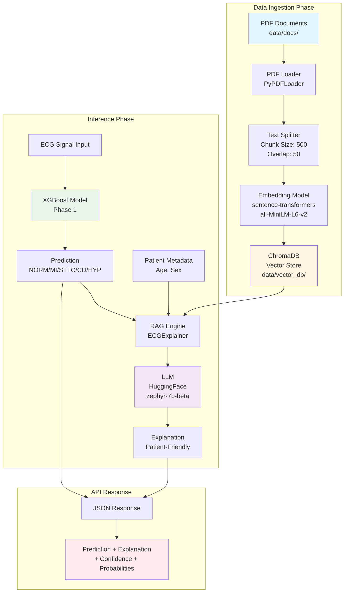
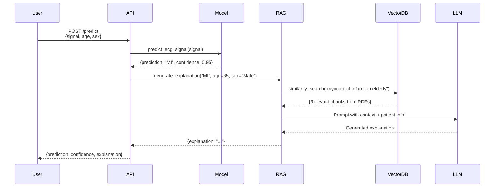

# RAG Architecture Diagram

## System Architecture: RAG-Enhanced ECG Explanation Pipeline



## Data Flow Diagram



## Component Details

### 1. Document Ingestion (`src/ingest.py`)
- **Input:** 5 PDF files in `data/docs/`
- **Process:**
  1. Load PDFs using PyPDFLoader
  2. Split into chunks (500 chars, 50 overlap)
  3. Embed using local sentence-transformers model
  4. Store in ChromaDB vector database
- **Output:** Persistent vector store at `data/vector_db/`

### 2. RAG Engine (`src/rag_engine.py`)
- **ECGExplainer Class:**
  - Loads vector store on initialization
  - Initializes HuggingFace LLM via API
  - Retrieves relevant context based on diagnosis + patient metadata
  - Generates personalized explanations

### 3. API Integration (`src/api/routers/predict.py`)
- **Enhanced `/predict` endpoint:**
  - Accepts: `signal`, `age`, `sex` (optional)
  - Returns: `prediction`, `confidence`, `explanation`, `probabilities`

### 4. Retrieval Strategy
- **Diagnosis-based search terms:**
  - NORM → "normal sinus rhythm", "normal ECG"
  - MI → "myocardial infarction", "heart attack"
  - STTC → "ST-T changes", "ischemia"
  - CD → "conduction disturbance", "bundle branch block"
  - HYP → "hypertrophy", "LVH"
- **Age-enhanced queries:**
  - < 30: "young adult"
  - 30-50: "middle-aged"
  - > 50: "elderly"

## File Structure

```
data/
├── docs/                    # PDF knowledge base
│   ├── MI_Recovery_Guide.pdf
│   ├── STTC_Ischemia_Guide.pdf
│   ├── Conduction_Disturbance_Guide.pdf
│   ├── Hypertrophy_Management.pdf
│   └── General_ECG_Guide.pdf
└── vector_db/              # ChromaDB vector store (generated)

src/
├── ingest.py                # Document ingestion pipeline
├── rag_engine.py            # RAG explanation generator
└── api/routers/predict.py   # Enhanced API endpoint
```

## Usage

1. **Ingest documents:**
   ```bash
   python manage.py ingest
   # or
   make rag
   ```

2. **Use in API:**
   ```bash
   python manage.py dev
   ```

3. **Test endpoint:**
   ```bash
   curl -X POST http://localhost:8000/predict \
     -H "Content-Type: application/json" \
     -d '{
       "signal": [[...]],
       "age": 65,
       "sex": "Male"
     }'
   ```
